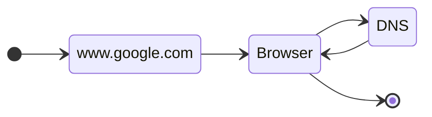
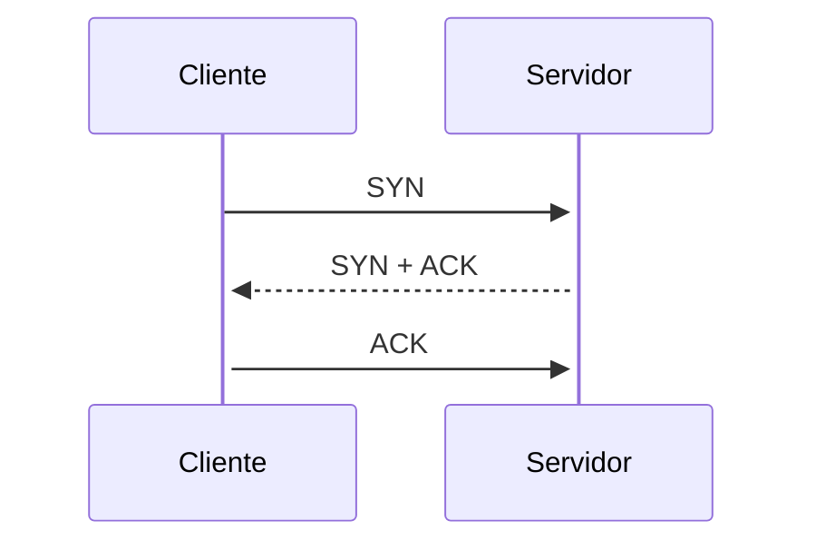

<br><br>
# Desenvolvimento Web
<br><br>
##### Pablo Leon Rodrigues

<div class="abs-br m-6 opacity-50 display: flex">
	<a href="https://github.com/pleonr" target="_blank" >
    	<svg xmlns="http://www.w3.org/2000/svg" width="32" height="32" viewBox="0 0 24 24"><path d="M5 3h14a2 2 0 0 1 2 2v14a2 2 0 0 1-2 2h-4.44c-.32-.07-.33-.68-.33-.89l.01-2.47c0-.84-.29-1.39-.61-1.67c2.01-.22 4.11-.97 4.11-4.44c0-.98-.35-1.79-.92-2.42c.09-.22.4-1.14-.09-2.38c0 0-.76-.23-2.48.93c-.72-.2-1.48-.3-2.25-.31c-.76.01-1.54.11-2.25.31c-1.72-1.16-2.48-.93-2.48-.93c-.49 1.24-.18 2.16-.09 2.38c-.57.63-.92 1.44-.92 2.42c0 3.47 2.1 4.22 4.1 4.47c-.26.2-.49.6-.57 1.18c-.52.23-1.82.63-2.62-.75c0 0-.48-.86-1.38-.93c0 0-.88 0-.06.55c0 0 .59.28 1 1.32c0 0 .52 1.75 3.03 1.21l.01 1.53c0 .21-.02.82-.34.89H5a2 2 0 0 1-2-2V5a2 2 0 0 1 2-2z" fill="currentColor"/></svg>
    </a>
    <a href="mailto:pablo.leonrodrigues@gmail.com" target="_blank" >
    	<svg xmlns="http://www.w3.org/2000/svg" width="32" height="32" viewBox="0 0 24 24"><path fill="currentColor" d="M5 3a2 2 0 0 0-2 2v14a2 2 0 0 0 2 2h14a2 2 0 0 0 2-2V5a2 2 0 0 0-2-2zm1.4 3.5h11.2c.77 0 1.4.62 1.4 1.4v8.2a1.4 1.4 0 0 1-1.4 1.4H6.4c-.77 0-1.4-.63-1.4-1.4V7.9c0-.78.62-1.4 1.4-1.4M6 8v2l6 4l6-4V8l-6 4z"/></svg>
    </a>
    <a href="https://www.linkedin.com/in/pablo-leon-rodrigues-9b47a824/" target="_blank" >
    	<svg xmlns="http://www.w3.org/2000/svg" width="32" height="32" viewBox="0 0 24 24"><path fill="currentColor" d="M19 3a2 2 0 0 1 2 2v14a2 2 0 0 1-2 2H5a2 2 0 0 1-2-2V5a2 2 0 0 1 2-2zm-.5 15.5v-5.3a3.26 3.26 0 0 0-3.26-3.26c-.85 0-1.84.52-2.32 1.3v-1.11h-2.79v8.37h2.79v-4.93c0-.77.62-1.4 1.39-1.4a1.4 1.4 0 0 1 1.4 1.4v4.93zM6.88 8.56a1.68 1.68 0 0 0 1.68-1.68c0-.93-.75-1.69-1.68-1.69a1.69 1.69 0 0 0-1.69 1.69c0 .93.76 1.68 1.69 1.68m1.39 9.94v-8.37H5.5v8.37z"/></svg>
    </a>
    <a href="https://leon.dev.br" target="_blank" >
    	<svg xmlns="http://www.w3.org/2000/svg" width="32" height="32" viewBox="0 0 24 24"><path fill="currentColor" d="M8.95 13.4H6.58a5.5 5.5 0 0 1 0-2.8h2.37a11.56 11.56 0 0 0-.1 1.4a11.56 11.56 0 0 0 .1 1.4M7.16 9.2H9.2a12.06 12.06 0 0 1 .98-2.49A5.55 5.55 0 0 0 7.16 9.2m9.68 0a5.59 5.59 0 0 0-3.03-2.49a10.95 10.95 0 0 1 .97 2.49M12 17.57a9.5 9.5 0 0 0 1.34-2.77h-2.68A9.5 9.5 0 0 0 12 17.57m0-11.15a9.53 9.53 0 0 0-1.34 2.78h2.68A9.53 9.53 0 0 0 12 6.42M7.16 14.8a5.61 5.61 0 0 0 3.02 2.49a12.06 12.06 0 0 1-.98-2.49M21 5v14a2 2 0 0 1-2 2H5a2 2 0 0 1-2-2V5a2 2 0 0 1 2-2h14a2 2 0 0 1 2 2m-2 7a7 7 0 1 0-7 7a7 7 0 0 0 7-7m-3.85 0a11.56 11.56 0 0 1-.1 1.4h2.37a5.5 5.5 0 0 0 0-2.8h-2.37a11.56 11.56 0 0 1 .1 1.4m-1.34 5.29a5.62 5.62 0 0 0 3.03-2.49h-2.06a10.95 10.95 0 0 1-.97 2.49m-3.45-6.69a8.81 8.81 0 0 0 0 2.8h3.28a10.3 10.3 0 0 0 .11-1.4a10.21 10.21 0 0 0-.11-1.4Z"/></svg>
    </a>
</div>

---

<Toc maxDepth="2"></Toc>

---
layout: image-right
image: /Sir_Tim_Berners-Lee.jpg
---
## Breve resumo da história da Web

A world wide web(www) como conheçemos hoje é produto de vários trabalhos e pesquisas, mas principalmente
reconhecida como trabalho de [Sir Tim Berners-Lee](https://www.w3.org/People/Berners-Lee/){style="color: blue;"}, desenvolvido no CERN em 1989.

Ele é creditado como criador das especificações URIs, HTTP and HTML.

## Camadas da Web

- **Internet** ARPANET 1969, *J.C.R Licklider* e TCP/IP 1975, *Cerf & Kahn*
- **Email** 1971, *Ray Tomlinson*
- **Browsers** DOS Houdini 1986, *Neil Larson* e Mosaic 1993, *Marc Andreessen*

<!-- 
WWW World Wide Web 1989 at CERN(*Conseil européen pour la Recherche nucléaire*) Tim Berners-Lee <p>
Criado para compartilhar dados entre máquinas no CERN <p>
W3C - https://www.w3.org/ World Wide Web Consortium <p>
HTTP - Hypertext Transfer Protocol 1989 at CERN Tim Berners-Lee
HTML - 1989 publicado 1991

ARPA - Atual DARPA(*Defense Advanced Research Projects Agency*) 
-->
---


<!--
 A ARPA criou a ARPANET (*Advanced Research Projects Agency Network*). <p>
Era simultaneamente um backbone e uma rede experimental, inicialmente <p> 
a ARPANET ligou 4 universidades.

Ray Tomlinson criou o primeiro programa para a ARPANET(email)
-->

---

## Como funciona?

Computadores(no sentido amplo da palavra) conectados a internet assumem o papel de cliente ou servidor.

O cliente faz uma requisição para o servidor, que responde com algum conteúdo.

<br>


<!--
There are more things in heaven and earth, Horatio, than are dreamt of in your philosophy.
--William Shakespeare <p>

Internet connection, TCP/IP, DNS, HTTP, Code, Assets<p>
DNS - Domain Name Server <p>
HTTP - Hyper Text Transfer Protocol <p>
Outras URI, são URN(uniform resource names), são definidos no RDF(Resource Description Framework) mantido pela W3C
-->
---

## URI

URI(*Uniform Resource Identifier*) é uma sequência de caracteres utilizada para identificar um recurso na rede.
O tipo mais comum de URI é a URL(*Uniform Resource Locator*)

## Anatomia da URL

<br>

<pre class="pre">          <span style="color:rgb(0, 76, 178)">userinfo</span>       <span style="color:rgb(0, 177, 17)">host</span>      <span style="color:rgb(178, 111, 0)">port</span>
          <span style="color:rgb(0, 76, 178)">┌──┴───┐</span> <span style="color:rgb(0, 177, 17)">┌──────┴──────┐</span> <span style="color:rgb(178, 111, 0)">┌┴┐</span>
  https://john.doe@www.example.com:123/forum/?tag=networking&amp;order=newest#top
  <span style="color:rgb(178, 111, 0)">└─┬─┘</span>   <span style="color:rgb(176, 0, 177)">└─────────────┬────────────┘</span><span style="color:rgb(0, 76, 178)">└──┬──┘</span> <span style="color:rgb(0, 178, 17)">└────────────┬────────────┘</span> <span style="color:rgb(178, 111, 0)">└┬┘</span>
  <span style="color:rgb(178, 111, 0)">scheme</span>          <span style="color:rgb(176, 0, 177)">authority</span>            <span style="color:rgb(0, 76, 178)">path</span>              <span style="color:rgb(0, 178, 17)"><span style="color:rgb(0, 178, 17)">query</span></span>         <span style="color:rgb(178, 111, 0)">fragment</span>

  mailto:John.Doe@example.com
  <span style="color:rgb(178, 111, 0)">└─┬──┘</span> <span style="color:rgb(0, 76, 178)">└────┬─────────────┘</span>
  <span style="color:rgb(178, 111, 0)">scheme</span>     <span style="color:rgb(0, 76, 178)">path</span>
</pre>

---

## DNS Lookup
<br>

- Para acessar um determinado site ou aplicativo você digita uma URL (exemplo, www.google.com) na barra de endereço 
do navegador.
- Essa URL é um nome feito para ser lido por humanos, a comunicação entre cliente e servidor é feita utilizado endereços
numéricos chamados endereços de IP(*IP address*). 
- Para fazer essa conversão de URL para IP, o *browser* se comunica com um servidor DNS(*Domain Name System*). Pense 
nele como uma agenda telefonica. Nome > número
- O DNS procura o endereço associado a URL enviada e retorna esse IP para o *browser*

<br>


---
layout: two-cols
---

## TCP
TCP(*Transmission Control Protocol*, Protocolo de Controle de Transmissão) é um protocolo de comunicação que permite que programas aplicativos e dispositivos de computação troquem mensagens 
em uma rede. Ele foi projetado para enviar pacotes (de dados) pela Internet e garantir a entrega bem-sucedida 
de dados e mensagens pela rede.

## IP 
IP(*Internet Protocol*, Protocolo de internet) é responsável por fazer o roteamento dos pacotes de dados pela Internet com base em seus endereços IP.

::right::

## Handshake

- Com o endereço IP em mãos, o navegador tenta iniciar uma conexão TCP com o servidor web nesse endereço.
  - Também conhecida como *Three-way handshake* ou SYN-SYN-ACK o *TCP Handshake* é a comunicação necessária para
    estabelecer a sessão TCP.

---
layout: two-cols
---

O TCP Handshake é um mecanismo projetado para que duas entidades (no nosso caso, o cliente e o servidor) que
desejam passar informações entre si possam negociar os parâmetros da conexão antes de transmitir os dados.

- O navegador envia uma mensagem `SYNC` para o servidor solicitando SYNchronization
(*synchronization means the connection*)
- O servidor responde com uma mensagem `SYN + ACK` (*SYNChronization and ACKnowledgement*)
- O cliente então finaliza enviando uma mensagem `ACK` (*ACKnowledgement*)

::right::

<br>



<!--
A comunicação através de HTTPS é um pouco diferente...
--> 


---

## HTTP
O *Hypertext Transfer Protocol*([HTTP](https://www.rfc-editor.org/rfc/rfc9110.html){style="color: blue;"}) é um protocolo que define como é feita a comunicação entre cliente e servidor.
Conceitos-chave:

- *Methods* : Definem o que o servidor deve fazer com o request, sendo:
  - GET para recuperar informação
  - POST/PUT para enviar dados
  - DELETE remover dados
- URL: caminho do site ou aplicativo desejado
- *Headers* : Fornecem informação adicional sobre os dados sendo enviados,
  preferências de linguagem, cookies


<!--
Internet protocol suite
- Application layer
  - DHCP, DNS, FTP, HTTP, HTTPS, IMAP, IRC, LDAP, SMTP, SNMP, SSH, Telnet, TLS/SSL, ... 
- Transport layer
  - TCP, UDP, DCCP, ...
- Internet layer
  - IP, ICMP, IPsec, ...
-Link layer
  - ARP, Tunnels, PPP, MAC, ...
-->

---


## Request & Response

### General
```html {all|1|2|3|4|5|all} twoslash
Request URL: https://leon.dev.br/
Request Method: GET
Status Code: 200 OK
Remote Address: 185.199.108.153:443
Referrer Policy: strict-origin-when-cross-origin
```

### Request Headers
```html {all||6-9|all} twoslash
Sec-Ch-Ua: "Not A(Brand";v="99", "Google Chrome";
    v="121", "Chromium";v="121"
Sec-Ch-Ua-Mobile: ?1
Sec-Ch-Ua-Platform: "Android"
Upgrade-Insecure-Requests: 1
User-Agent: Mozilla/5.0 (Linux; Android 6.0;
    Nexus 5 Build/MRA58N) AppleWebKit/537.36 
    (KHTML, like Gecko) Chrome/121.0.0.0 Mobile 
    Safari/537.36
``` 

---

### Response Headers
```html {all} twoslash
Accept-Ranges: bytes
Access-Control-Allow-Origin: *
Age: 0
Cache-Control: max-age=600
Content-Encoding: gzip
Content-Length: 3553
Content-Type: text/html; charset=utf-8
Date: Tue, 13 Feb 2024 22:30:23 GMT
Expires: Tue, 13 Feb 2024 22:40:23 GMT
Last-Modified: Sun, 04 Feb 2024 13:52:33 GMT
Server: GitHub.com
Vary: Accept-Encoding
X-Fastly-Request-Id: 
    9faddf5d2c8006c085438f7c68a7cbf80a3d4fe7
X-Github-Request-Id: 
    CF3A:65E93:116AA8:142208:65CB93E8
X-Served-By: cache-gru-sbgr1930075-GRU
X-Timer: S1707863423.250750,VS0,VE143
``` 
<!--
Referrer Policy pode ser utilizado para rastrear informações de navegação
-->

---

## Status Code

Depois de processar o que foi solicitado no request ele envia o response de volta para o browser contendo:
- *Status Code*: indica se a solicitação foi bem-sucedida (por exemplo, 200 para OK, 404 para Não encontrado).
- *Headers*: fornecem informações adicionais sobre a resposta, como o tipo de conteúdo (por exemplo, HTML, imagem).
- *Body*: Contém os dados reais solicitados, normalmente em formato HTML para páginas da web.

O [Status Code](https://datatracker.ietf.org/doc/html/rfc7231){style="color: blue;"} fornece informações sobre o resultado do request. Os status são agrupados em:

- 1xx - Informativo
- 2xx - Sucesso
- 3xx - Redirecionamento
- 4xx - Erro no cliente
- 5xx - Erro no servidor

---
layout: two-cols
---

### [200](https://httpstatusdogs.com/200-ok) - Retorno com sucesso em um HTTP request

::right::
### [404](https://httpstatusdogs.com/404-not-found) - O *resource* solicitado não foi encontrado


<!--
https://developer.mozilla.org/en-US/docs/Web/HTTP/Status
http://httpstatus.com.br/
https://httpstatusdogs.com/
-->
---

# HTML

```html
<!DOCTYPE html>
<html lang="en">
<head>
  <meta charset="UTF-8">
  <meta name="viewport" content="width=device-width, initial-scale=1.0">
  <title>Hello World!</title>
  <link rel="stylesheet" href="style.css">
</head>
<body>
  <h1 id="hello-message">Hello World!</h1>
  <script src="script.js"></script>
</body>
</html>
```

---
layout: two-cols
---

## *Parsing* HTML

Após receber o conteúdo do *response*, o navegador vai começar a fazer o *Parsing* dos dados. **Parsing** significa 
analisar e converter um programa em um formato interno para ser executado.

O Navegador vai então usar um componente chamado *Engine* ou motor para fazer o *Parsing*. Existem diversos tipos de 
*Engine*:

- Blink(Chromium): Chrome, Edge, Brave, Vivaldi, Opera... Escrito em `C++` e mantido pelo Google.
- Gecko: Firefox. Escrito em `C++ e JavaScript`, recentemente começou ter partes escritas em `Rust` e mantido pela 
Mozilla.
- WebKit: Safari, Otter, Epiphany, escrito em `C++` e mantido pela Apple.

::right::

### *Tokenization*

No processo de *Tokenization*, é feita uma análise léxica do documento e convertido em tokens, imagine separar uma frase 
em palavras


---
layout: two-cols
---
## *DOM*

Depois que o primeiro token é criado, começa o processo de *tree building*, que cria uma estrutura chamada DOM(*Document
Object Model*), e vai adicionando os tokens gerados.

A árvore é montada começando pelo elemento root `<html>` e vai refletindo a arquitetura utilizada entre as tags,
definindo `parent nodes` e `child nodes`, quanto mais *nodes*, mais tempo vai levar para criar o DOM tree.

Enquanto o DOM é criado conforme novos tokens são gerados, eles são adicionados ao DOM. Ao encontrar recursos como 
CSS stylesheets, Javascript files, fontes de texto ou bibliotecas, o parser para a execução, espera o download desses
arquivos para continuar a geração.

::right::


<!--
That's why, if yu're working with Javascript it is recommended to add your <script> 
tags at the end of the HTML file, or if you want to keep them in the <head> tag, you should 
add to them the defer or async attribute (async allows for asynchronous as soon as the script is
downloaded and defer allows execution only after the whole document has been parsed).
-->

---
layout: two-cols
---


## *Parsing* CSS

```css
body {
  font-size: 16px;
  color: white;
} 
h1 {
  font-size: 32px;
}
section {
  color: tomato;
}
section .mainTitle {
  margin-left: 5px
}
div {
  font-size: 20px;
}
```

::right::

Se existir folha de estilos, é realizado o *parsing* do CSS sendo criado o CSSOM(*CSS Object Model*). Utilizando 
Tokenization, o parser recebe os bytes, converte em caracteres, depois tokens, depois nodes e depois
eles são conectados no CSSOM.


---
layout: two-cols
---

## Javascript

Quando existe Javascript no response, ele deve ser primeiro compilado e/ou interpretado, para isso é utilizado um motor 
Javascript. Dentre os motores mais utilizados estão, V8, Javascript core, Chakra e SpiderMonkey.

### Compilação

No processo de compilação, o código escrito em uma linguagem de alto nível é convertido em linguagem de máquina gerando
um object file, para depois ser executado ou não.

### Interpretação

Durante o processo de interpretação o código é "lido" linha a linha e executado imediatamente.


::right:: 

### JIT

JIT(*Just in time compilation*) e trabalha intercalando compilação e interpretação. Dessa forma o código é traduzido para
linguagem de máquina enquanto é executado. Essa execução vai compilar o código para linguagem de máquina.

Apesar de Javascript ser uma linguagem interpretada e não precisar de compilação, a maioria dos navegadores utiliza JIT

---

## Paint

Após todo o processo visto anteriormente o navegador processa todo o conteúdo gerado e organiza o layout para ser
renderizado. 


---

## Referências
___
https://www.w3.org/People/Berners-Lee/ 

https://en.wikipedia.org/wiki/Uniform_Resource_Identifier#Conception

https://medium.com/@rohitpatil97/http-request-http-response-context-and-headers-part-iii-5c37bd4cb06b

https://www.iana.org/assignments/uri-schemes/uri-schemes.xhtml

https://developer.mozilla.org/en-US/docs/Web/HTTP/Headers

https://www.rfc-editor.org/rfc/rfc9110.html

https://developer.mozilla.org/en-US/docs/Web/Performance/How_browsers_work#overview

https://dev.to/arikaturika/how-web-browsers-work-part-1-with-illustrations-1nid

https://www.w3.org/Style/CSS20/history.html

https://developer.mozilla.org/en-US/docs/Glossary/Call_stack

https://dev.to/arikaturika/how-web-browsers-work-the-render-tree-part-7-with-illustrations-24h3