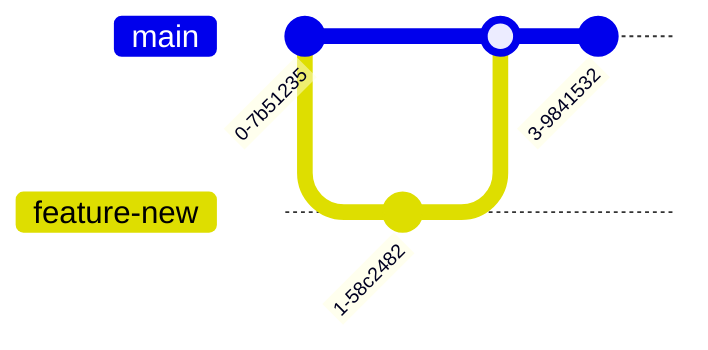

---

<Toc columns="1" maxDepth="3"></Toc>

---
layout: two-cols
---

## Git

Git é um sistema de controle de versionamento criado em 2005 Por Linus Torvalds. Ele é mantido por Junio Hamano.

Em 7 de Abril de 2005 Linus Torvalds fez o primeiro
[commit](https://github.com/git/git/blob/e83c5163316f89bfbde7d9ab23ca2e25604af290/README) 
do código do git com a mensagem:

```
Initial revision of "git", the
 information manager from hell
```
::right::


<!--
Piada com Hellsink
GIT - the stupid content tracker

"git" can mean anything, depending on your mood.

 - random three-letter combination that is pronounceable, and not 
   actually used by any common UNIX command.  The fact that it is a
   mispronunciation of "get" may or may not be relevant.
 - stupid. contemptible and despicable. simple. Take your pick from the 
   dictionary of slang.
 - "global information tracker": you're in a good mood, and it actually
   works for you. Angels sing, and a light suddenly fills the room. 
 - "goddamn idiotic truckload of sh*t": when it breaks

This is a stupid (but extremely fast) directory content manager.  It  
doesn't do a whole lot, but what it _does_ do is track directory
contents efficiently.
 
Initialize Git on a folder, making it a Repository
Git now creates a hidden folder to keep track of changes in that folder
When a file is changed, added or deleted, it is considered modified
You select the modified files you want to Stage
The Staged files are Committed, which prompts Git to store a permanent snapshot of the files
Git allows you to see the full history of every commit.
You can revert back to any previous commit.
Git does not store a separate copy of every file in every commit, but keeps track of changes made in each commit!
-->

---
layout: two-cols
---

## Como começar

Para configurar o git para nosso usuário:

```shell
git config --global user.name "nome"
git config --global user.email "email"
```

O parâmetro `--global` seta as configurações para todos os repositórios. Ao remover esse parâmetro
a configuração é adicionada no repositório aberto

Vamos criar uma pasta para nosso projeto e inicializamos o repositório

```shell
mkdir projeto
cd projeto
git init
```

Isso vai criar uma pasta chamada `.git`

::right::

Para verificar o conteúdo do repositório podemos usar o comando `git status`.

Ao adicionarmos um arquivo ao repositório o git vai "perceber" que existe um arquivo não versionado.
Para versionar esse arquivo primeiro, precisamos adicioná-lo ao `staging`.

```shell
git add index.html
```

Ainda temos as opções:

- `git add -A` adiciona todas as alterações ao stage
- `git add .` adiciona modificações sem novos arquivos ou remoções
- `git add -u` adiciona modificações e remoções, sem novos arquivos

<!--
git status --short 
?? - Untracked files
A - Files added to stage
M - Modified files
D - Deleted files
-->

---

Agora que temos arquivos em `stage`, podemos "commitar"(`commit`). Um
`commit` é como um "ponto de backup", ao trabalhar podemos voltar para o estado de um `commit` caso necessário

Sempre enviamos uma mensagem junto de um `commit`.

```shell
git commit -m "First Hello World!"
```

Quando criamos um commit uma hash é gerada, essa hash pode ser utilizada para referênciar o commit(como um id).

```shell
commit fe1c6bcbe4bce74c6d75e74da97cfaf8ed0057bf (HEAD -> main, origin/main, origin/HEAD)
Author: pleonr <pablo.leonrodrigues@gmail.com>
Date:   Mon Jun 3 10:04:57 2024 -0300

    First Hello World!  
```

`origin` é o nome padrão do repositório remoto, `HEAD` é um ponteiro para o commit atual no repositório local.
que originou o repositório.
`origin/main` é uma referência local que aponta para o `commit` referenciado por `HEAD` no repositório remoto
denominado `origin`.

<!--
- Gerencie projetos com Repositórios(`repositories`) 
- Clone(`clone`) um projeto para trabalhar em uma cópia local 
- Controle e rastreie alterações com preparação(`staging`) e confirmação(`commit`) 
- Branch(`branch`) and Merge(`merge`) para permitir o trabalho em diferentes partes e versões de um projeto
- Extraia(`pull`) a versão mais recente do projeto para uma cópia local 
- Envie(`push`) atualizações locais para o projeto principal
-->

---

## git log

Para verificar o histórico do repositório podemos utilizar o `git log`. 

```shell
commit fe1c6bcbe4bce74c6d75e74da97cfaf8ed0057bf (HEAD -> main, origin/main, origin/HEAD)
Author: pleonr <pablo.leonrodrigues@gmail.com>
Date:   Mon Jun 3 10:04:57 2024 -0300

    First Hello World!  
```

Porém, o log fica um pouco "extenso", podemos melhorar como o log é mostrado 
usando algumas flags como `decorate` e `pretty format`.

```shell
git log --oneline --all --decorate
git log --oneline --all --decorate --graph
git log --pretty=format:"%h %(refname:short)  %s (%an)"
```

---
layout: two-cols
---

## git branch

Uma branch é um ponteiro móvel leve para um commit. As branchs são usadas para desenvolver recursos, corrigir bugs ou experimentar novas ideias isoladamente de outros 
trabalhos realizados no mesmo repositório.

Você pode criar uma nova branch usando o comando `git branch branch-name`. Isso cria um novo ponteiro para o
commit atual. Qualquer nome pode ser utilizado, mas é uma boa prática indicar a utilidade da branch em seu nome, facilitando 
a identificação e mantendo o repositório organizado.

Você pode mudar para um branch diferente usando `git checkout -b branch-name` ou o comando mais recente
`git switch branch-name`.

Para listar as branchs utilize `git branch -r`.

::right::

Para compartilhar essa branch e manter um histórico precisamos envia-lá para o repositório remoto.

```shell
git push origin branch-name
ou
git push --set-upstream origin branch-name
```

Depois que seu trabalho em um branch for concluído, você poderá efetuar o `merge` usando `git merge branch-name`.
Em ambientes colaborativos o comum é criar um `pull request` onde o código será avaliado e só então mergeado.

Quando uma ramificação não for mais necessária, você poderá excluí-la usando `git branch -d branch-name`
para ramificações que foram mescladas ou `git branch -D branch-name` para forçar a exclusão.

---
layout: two-cols
---

<br>
<br>
<br>


```shell    
git checkout main
git branch feature-new
git checkout feature-new
git add .
git commit -m "new feature"
git checkout main
git merge feature-new
git branch -d feature-new
```

::right::

<br>
<br>
<br>
<br>




---
layout: image
image: /github-bitbucket-gitlab.png
background-size: contain
---

---


---
layout: two-cols
---

## Github Pages

O [GitHubPages](https://pages.github.com/) são páginas públicas hospedadas e publicadas através do GitHub.
Ele permite que qualquer usuário hospede uma página web para um repositório ou usuário gratuitamente.

### Crie um repositório

Vá para o GitHub e crie um novo repositório público chamado `nomedeusuário.github.io`, onde nomedeusuário é o seu 
nome de usuário (ou nome da organização) no GitHub. 
Se a primeira parte do repositório não corresponder exatamente ao seu nome de usuário, não funcionará!
então certifique-se de acertar.

::right::


---

### Clonar o repositório

Vamos clonar esse repositório criado e trabalhar nele...

```shell
git clone https://github.com/65375/65375.github.io
```

Dentro dele vamos começar a criar a página que queremos. Adicionando HTML, CSS, Javascript e tudo que trabalhamos 
durante o semestre. Não esqueça de commitar...

```shell
git add .
git commit -m "blog pessoal"
```

Nesse momento é melhor conferir as configurações do git:

```shell
git config user.name "65375"
git config user.email "pabloleon@upf.br"
```

---
layout: two-cols
---

### Push

Agora envie o commit para o repositório do github:

```shell
git push -u origin main
```

Aqui talvez seja necessário uma validação extra.. Caso seja necessário inserir o usuário e senha, talvez você encontre
um erro dizendo que o github não permite alterações utilizando a senha do usuário.

Para resolver isso vamos criar um personal token. Vá até `https://github.com/settings/profile` e procure a opção 
[`Developer Settings`](https://github.com/settings/apps), provavelmente a última opção no menu lateral.


::right::

Aqui vamos criar um token que vai ter permissões atreladas a ele.


<br>

E clique em Generate new Token

---
layout: two-cols
---


Aqui podemos definir todas as permissões que queremos atribuir a esse token.

::right::


Na próxima vez que você tentar fazer push, utilize esse token gerado.