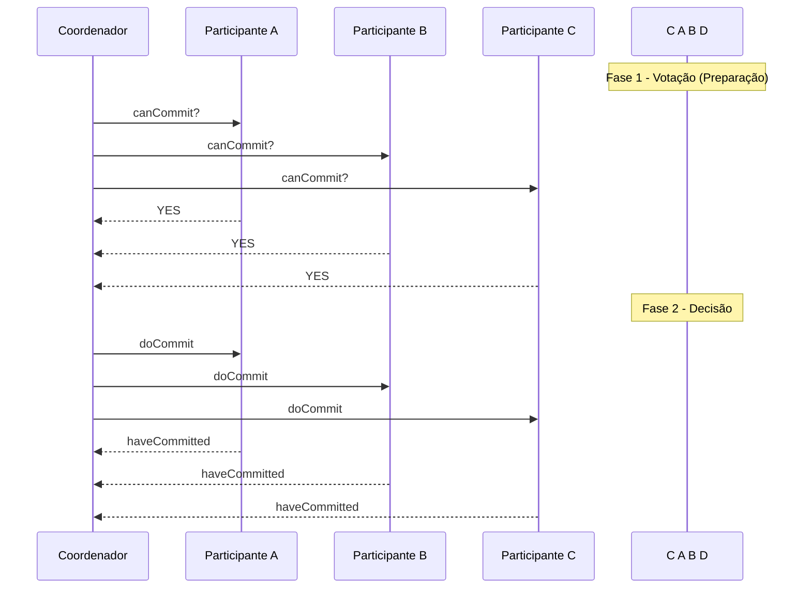
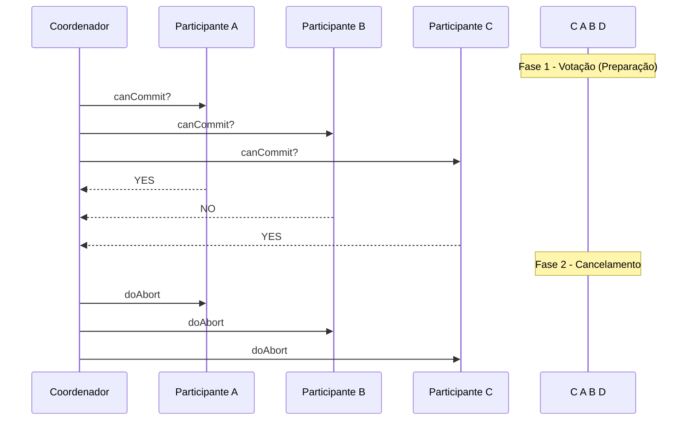

---

## Sumário

- Bancos de Dados Distribuídos
- Armazenamento de dados Distribuídos
- Transações
- Transações distribuídas
- 2PC
- 3PC

---

| Banco de Dados Distribuído                                 | Banco de Dados Centralizado                                      |
|------------------------------------------------------------|------------------------------------------------------------------|
| Vários arquivos de banco de dados são armazenados em locais distintos. | É composto por um único arquivo de banco de dados.              |
| Múltiplas pessoas podem acessar e alterar os dados ao mesmo tempo. | Gargalos ocorrem quando muitos usuários acessam o mesmo arquivo simultaneamente. |
| Os arquivos são enviados rapidamente a partir da localização mais próxima do usuário. | É possível que a entrega de arquivos aos usuários leve mais tempo. |
| Os dados podem ser recuperados se um dos sites falhar.     | Em caso de falha do sistema, um único site representa indisponibilidade total. |
| É necessária a sincronização de vários arquivos de diferentes bancos. | Em um sistema central, é mais fácil atualizar e gerenciar os dados. |

---
layout: two-cols
---

### Conceitos Fundamentais

- BDD: Coleção de bases de dados logicamente integradas, mas fisicamente distribuídas por uma rede de computadores.

- SGBD-D: Sistema Gerenciador de Banco de Dados Distribuído. Responsável por manter a transparência da distribuição para o usuário final.

Transparência em BDD abrange:

- Localização
- Fragmentação
- Replicação
- Transações distribuídas

::right::

Necessidade de descentralização e alta disponibilidade.

Ex: empresas com várias filiais, redes de hotéis, aplicativos móveis, controle militar, etc.

- Confiabilidade
- Desempenho
- Expansão facilitada

---
layout: two-cols
---

### Armazenamento Distribuído

O armazenamento pode ocorrer de trê formas, `Fragmentação`, `Replicação` ou `Híbrido`.

#### Híbrido:

Combina Fragmentação e Replicação, onde os fragmentos podem ser replicados para garantir disponibilidade e desempenho.

Isso traz flexibilidade, mas aumenta a complexidade do gerenciamento.


::right::

#### Replicação

A replicação consiste em manter cópias dos mesmos dados em mais de um local. Isso melhora a disponibilidade, resiliência a falhas e pode aumentar o desempenho de leitura.

- **Total**: a relação inteira (tabela) é replicada.
- **Parcial**: apenas parte dos dados é replicada (linhas ou colunas específicas).
- **Síncrona**: cópias atualizadas em tempo real (maior custo de comunicação).
- **Assíncrona**: cópias atualizadas periodicamente (pode haver inconsistência temporária).

---
layout: two-cols
---

#### Fragmentação

Em vez de duplicar dados, a fragmentação os divide entre os nós

- **Horizontal**: Fragmenta a tabela por linhas onde cada fragmento contém um subconjunto das linhas da tabela original. Reconstrução via UNION, útil quando diferentes regiões acessam subconjuntos dos dados.

```sql
SELECT * FROM clientes_USA
UNION
SELECT * FROM clientes_Europa;
```

::right::

- **Vertical**: Fragmenta a tabela por colunas. Cada fragmento contém subconjuntos de colunas, com a chave primária replicada. Reconstrução via JOIN. Útil quando diferentes aplicações precisam de partes diferentes dos dados.

```sql
SELECT * FROM clientes_nome
JOIN clientes_endereco USING (id_cliente);
```

---

| Modelo        | No 1                  | No 2                  | No 3                  | No n                  |
|---------------|------------------------|------------------------|------------------------|------------------------|
| **Centralizado** | ABCD EFGH IJKL <br> MNOP QRST UVXZ |                        |                        |                        |
| **Fragmentado**  | ABC <br> DEF          | GHI <br> JKL           | MNO <br> PQR           | STU <br> VXZ           |
| **Replicado**    | ABCD EFGH IJKL <br> MNOP QRST UVXZ | ABCD EFGH IJKL <br> MNOP QRST UVXZ | ABCD EFGH IJKL <br> MNOP QRST UVXZ | ABCD EFGH IJKL <br> MNOP QRST UVXZ |
| **Híbrido**      | ABCD <br> EFGH        | ABCD EFGH <br> IJKL    | IJKL MNOP <br> QRST    | UVXZ                   |


---

#### Vantagens do Armazenamento Distribuído

- Desempenho: consultas podem ser resolvidas localmente, evitando tráfego de rede.

- Tolerância a falhas: se um nó falhar, os dados ainda estão disponíveis em outro.

- Escalabilidade: você pode adicionar nós e distribuir mais dados conforme necessário.

- Localidade dos dados: acesso mais rápido aos dados onde são mais usados.

---

### Transações

Uma transação é uma sequência lógica de operações (como INSERT, UPDATE, DELETE, SELECT) que deve ser executada como uma única unidade atômica.

Uma transação tem como objetivo manter o estado consistente do banco de dados, mesmo com múltiplos acessos simultâneos, falhas ou interrupções.

#### Exemplo clássico: Transferência bancária

Suponha que Alice transfere R$100 para Bob:
- Debita R$100 da conta de Alice
- Credita R$100 na conta de Bob

Se qualquer etapa falhar, a transação inteira deve ser cancelada. Nenhuma mudança parcial deve permanecer.

---

### Transações Distribuídas
Em sistemas distribuídos, as transações envolvem múltiplos bancos de dados (ou servidores/nós).

**Componentes:**

- Cliente: quem inicia a transação.
  - Planas (flat): modelo clássico, com início, commit/rollback e fim.
  - Aninhadas (nested): podem conter subtransações dentro da principal. A subtransação pode falhar e ser anulada sem comprometer a transação-pai.
- Participantes: servidores que detêm os dados envolvidos, fazem o join e executam suas operações locais.
- Coordenador: gerencia o commit da transação em todos os nós e determina se a transação pode ser finalizada com sucesso.

---
layout: two-cols
---

#### Possíveis Estados de uma Transação

As transações podem apresentar estados durante o andamento do processo.

- Ativa: está sendo executada.
- Parcialmente concluída: terminou todas as operações.
- Falhou: uma das operações falhou.
- Abortada: revertida (rollback).
- Confirmada: todas as operações foram concluídas com sucesso (commit).

::right::

#### Cenários de Falha

Dentre as falhas que podem acontecer estão:

- Falha de rede: perda de conexão entre coordenador e participantes.
- Falha de participante: um servidor reinicia ou trava.
- Falha do coordenador: sistema entra em período de incerteza.

---

### Concorrência em BDD

Diversas técnicas são utilizadas para gerenciar a concorrência em sistemas de banco de dados distribuídos, incluindo:

- Bloqueio (Locking): Transações adquirem bloqueios sobre os dados que precisam acessar, impedindo que outras transações os modifiquem simultaneamente. Em sistemas distribuídos, o gerenciamento de bloqueios pode ser centralizado ou distribuído.

- Timestamp Ordering: Cada transação recebe um timestamp, e as operações são executadas na ordem dos timestamps para garantir a serializabilidade.

- Controle de Concorrência Otimista: Assume que conflitos são raros e permite que as transações sejam executadas sem bloqueios. No final, as transações são validadas para verificar se houve conflitos. Se houver, uma ou mais transações são desfeitas (rollback).

- Protocolos de Commit Atômico: Garantem que uma transação distribuída seja confirmada em todos os nós envolvidos ou seja desfeita em todos eles, mantendo a consistência global. O protocolo Two-Phase Commit (2PC) é um exemplo comum.

---

Em bancos de dados distribuídos (BDD) travas e bloqueios são mecanismos desenvolvidos para garantir controle de concorrência, ou seja, evitar que transações concorrentes acessem simultaneamente os mesmos dados de forma conflitante.

As travas funcionam como uma forma de reservar o acesso a um recurso (registro, tabela, etc.) para uma única transação por vez.

Um exemplo de trava é o `Uso exclusivo por chegada: 1 e 2`, nesse tipo de trada

- A primeira transação a chegar adquire a trava e tem uso exclusivo do recurso.
- A segunda (ou demais) transações devem aguardar a liberação da trava.
- Isso é típico em travas de leitura/escrita exclusivas, onde a exclusividade evita condições de corrida (race conditions).

---

#### Problema comum: Deadlock (impasse)

Quando múltiplas transações ficam esperando travas que só serão liberadas se outra transação terminar, pode haver ciclo de espera, formando um deadlock.

Um deadlock ocorre quando duas ou mais transações estão esperando indefinidamente por recursos que estão sendo mantidos umas pelas outras. Isso cria um ciclo de dependência sem saída.

Exemplo clássico:

- Transação T1 trava o Recurso A e precisa do Recurso B.
- Transação T2 trava o Recurso B e precisa do Recurso A.
- T1 e T2 ficam esperando indefinidamente uma pela outra → deadlock.

Estratégias para lidar com deadlocks:
- Prevenção: ordem pré-definida de travamento ou travar todos os objetos no início.
- Detecção: construção de grafo de espera, procurando por ciclos.
- Timeout: se uma transação demorar demais para adquirir uma trava, ela é abortada automaticamente.

---
layout: two-cols
---

#### Controle Otimista (Optimistic Concurrency Control - OCC)

O OCC parte do princípio de que conflitos entre transações são raros, e por isso não utiliza travas durante a execução normal das transações.

"Deixa todo mundo trabalhar à vontade, e só no final a gente verifica se deu tudo certo."

🛠 **Fase de Execução (ou Tentativa)**
- A transação executa livremente, sem bloquear dados.
- Manipula cópias locais ou versões temporárias dos dados (sem afetar os dados reais).

::right::


🛠 **Fase de Validação**
- Antes de finalizar, o sistema verifica se houve conflito com outras transações (ex: uma escrita em dado que foi lido).
- Se não houve conflito, a transação pode prosseguir.
- Se houve conflito, a transação é abortada e reiniciada.

🛠 **Fase de Atualização**
- Os dados modificados são aplicados ao banco real.
- Isso ocorre de forma atômica, garantindo consistência.

<!--
Onde é útil? Sistemas com baixo índice de conflitos.

Ambientes distribuídos, onde usar travas pode ser custoso.
Aplicações com muito mais leituras do que escritas (ex: dashboards, BI, sistemas de consulta).

✅ Vantagens
Evita deadlocks (não há travas durante execução).
Alta taxa de paralelismo.
Boa performance em ambientes com poucas colisões.

⚠️ Desvantagens
Pode haver repetidas reexecuções de transações em ambientes com muitos conflitos.
Desperdício de recursos se muitas transações forem abortadas na validação.

Imagina dois clientes tentando atualizar o mesmo saldo bancário:

Ambos leem o saldo = 100
Cliente A faz +50, Cliente B faz -30
Na fase de validação, o sistema vê que ambos leram o mesmo dado e tentaram escrever
Apenas um terá permissão para escrever (o outro será abortado)
-->

---
layout: two-cols
---

#### Controle por Marcação Temporal (Timestamp Ordering)

Cada transação recebe um timestamp (carimbo de tempo) único no momento em que começa.
Todas as operações (leitura/escrita) da transação devem respeitar a ordem temporal estabelecida por esses timestamps.

"Quem chega primeiro, tem prioridade."

Cada dado no banco mantém:
- TS_W(X) = timestamp da última escrita no dado X
- TS_R(X) = timestamp da última leitura no dado X

::right::

🧾 1. Leitura de X por transação T:

- Permitida se TS(T) ≥ TS_W(X) → transação é mais nova que a última escrita.
- Aborta se TS(T) < TS_W(X) → transação está lendo dado que já foi sobrescrito por outra mais nova.

✍️ 2. Escrita de X por transação T:
- Permitida se TS(T) ≥ TS_R(X) e TS(T) ≥ TS_W(X)
- Aborta se a transação for mais velha que alguma leitura ou escrita já feita → violaria a ordem.

<!--

✅ Vantagens
Sem deadlocks
→ão usa travas. Portanto, não há espera circular.
Transações serializáveis
A ordem dos timestamps assegura uma execução correta (equivalente a uma serial).

Boa para ambientes altamente concorrentes
Especialmente onde ordem temporal é importante.

⚠️ Desvantagens
Transações podem ser abortadas com frequência
Principalmente se os timestamps forem muito próximos ou mal distribuídos.

Pouco controle de reexecução
Transação abortada deve ser reiniciada do zero, com um novo timestamp.

Exemplo
Imagina duas transações:
T1 (timestamp 5): quer ler X
T2 (timestamp 10): já escreveu X
Se T1 tentar ler X agora, ela será abortada, porque sua leitura violaria a ordem: ela estaria lendo um valor que foi atualizado por uma transação mais nova (T2).

Timestamps podem vir de relógios lógicos (como Lamport) ou físicos (sincronizados com NTP).
Ideal quando se quer garantir ordenação causal ou tempo real.
Usado como base em sistemas sem travas como o Spanner (Google) ou certos bancos baseados em MVCC.
-->

---
layout: piramede
---

::center::

#### MVCC (Multiversion Concurrency Control)?

MVCC permite que várias versões de um mesmo dado coexistam no sistema, de forma que

- Leituras não bloqueiam escritas
- Escritas não bloqueiam leituras
- Cada transação vê uma visão consistente do banco de dados, como se fosse "congelada no tempo"

“Cada transação enxerga o mundo como ele era no momento em que começou.”

::left::

Leitura:
- A transação lê a versão mais recente do dado que foi criada antes dela iniciar
- Ignora alterações feitas por transações que ainda não tinham sido finalizadas

::right::

Escrita:
- Ao modificar um dado, o sistema não sobrescreve a versão atual, em vez disso, cria uma nova versão com novo timestamp
- As versões antigas permanecem para transações mais antigas ainda em andamento

<!--
✅ Vantagens:
Leituras consistentes e sem bloqueios (ótimo para workloads com muitas consultas)
Evita conflitos desnecessários entre leitores e escritores
Não há deadlock entre transações de leitura

⚠️ Desvantagens:
Acúmulo de versões antigas → precisa de mecanismo de limpeza (garbage collection)
Pode haver custo adicional de armazenamento e gerenciamento de versões

Bancos que usam MVCC:
PostgreSQL
Oracle
Couchbase
Spanner (Google)
TiDB
CockroachDB
-->

---

#### Controle baseado em Votos (Quorum-Based Protocols)

Nesse protocolo cada operação (leitura ou escrita) precisa de permissão de um subconjunto dos nós que mantêm réplicas do dado, esse subconjunto é chamado de quorum.

- Atribuição de Votos: Cada nó no sistema distribuído recebe um certo número de votos. Esse número pode ser igual para todos os nós ou variar dependendo de fatores como capacidade ou confiabilidade.

- Definição de Quóruns: São definidos dois tipos de quóruns:
  - Quórum de Leitura (Read Quorum - VR): O número mínimo de votos necessários para realizar uma operação de leitura em um determinado item de dados.
  - Quórum de Escrita (Write Quorum - VW): O número mínimo de votos necessários para realizar uma operação de escrita em um determinado item de dados.

---
layout: two-cols
---

##### Regras para Consistência

Para garantir a consistência dos dados, os quóruns de leitura e escrita devem obedecer às seguintes regras:

- VR + VW > V: A soma dos quóruns de leitura e escrita deve ser maior que o número total de votos (V) no sistema. Isso garante que sempre haverá uma interseção entre um quórum de leitura e um quórum de escrita, o que significa que uma leitura sempre obterá a versão mais recente dos dados.
- VW > V/2: O quórum de escrita deve ser maior que a metade do número total de votos. Isso garante que apenas uma operação de escrita possa ser realizada por vez, evitando conflitos de escrita.

::right::

##### Operações de Leitura e Escrita

<br>

- Leitura: Para ler um item de dados, uma transação precisa obter um quórum de leitura (VR) de votos dos nós que armazenam o item. A transação pode então ler o valor do item de qualquer nó que faça parte do quórum de leitura.
- Escrita: Para escrever um item de dados, uma transação precisa obter um quórum de escrita (VW) de votos dos nós que armazenam o item. A transação então envia a nova versão do item para todos os nós que fazem parte do quórum de escrita.

<!--
✅ Vantagens:
Garante consistência forte, mesmo com réplicas distribuídas.
Alta tolerância a falhas (se V_r e V_w forem bem escolhidos).
Escalabilidade: não precisa de coordenação global.

⚠️ Desvantagens:
Pode ser ineficiente em leitura ou escrita, se os valores de quorum forem altos.
Latência aumentada: exige múltiplos acessos simultâneos.
Mais complexo de gerenciar em comparação com modelos baseados em travas simples.

Exemplo
Sistemas com dados replicados (como Cassandra, DynamoDB, etc.).
Ambientes que exigem disponibilidade alta e escalabilidade.
Quando se quer flexibilidade entre consistência e desempenho (ex: leitura rápida vs. escrita confiável).

Considere um sistema com 5 nós, onde cada nó tem 1 voto. Podemos definir VR = 3 e VW = 3.
Para ler um item, precisamos obter 3 votos. Podemos ler de qualquer combinação de 3 nós.
Para escrever um item, precisamos obter 3 votos. Precisamos escrever em qualquer combinação de 3 nós.
Como VR + VW (3 + 3 = 6) é maior que V (5) e VW (3) é maior que V/2 (2.5), as regras de consistência são satisfeitas.

-->

---


#### Resumo Comparativo de Técnicas de Controle de Concorrência

| Técnica                    | Usa travas? | Tolerância a falhas | Deadlock? | Ideal para...                    |
|---------------------------|-------------|----------------------|-----------|----------------------------------|
| **Lock-based**            | Sim         | Baixa                | Sim       | Ambientes com muitos conflitos  |
| **Otimista (OCC)**        | Não         | Alta                 | Não       | Baixo conflito, leitura intensa |
| **Timestamp Ordering**    | Não         | Alta                 | Não       | Aplicações com ordem temporal   |
| **MVCC** (Multiversion)   | Sim (internamente) | Alta        | Não       | Leitura massiva, alta concorrência |
| **Quorum/Votação**        | Sim/Não     | Alta                 | Depende   | Controle de réplicas distribuídas |


---
layout: two-cols
---

### ACID

ACID é um conceito que se refere às quatro propriedades de transação de um sistema de banco de dados...

#### Atomicidade (Atomicity)

A transação deve ser executada por completo ou não ter efeito nenhum, se ocorrer uma falha no meio do caminho, todas as alterações parciais devem ser desfeitas (rollback).

Exemplo: Se uma transferência bancária falhar após o débito, o crédito também não deve acontecer.

#### Consistência (Consistency)

O banco de dados deve estar em um estado consistente antes e depois da transação, regras de integridade (como chaves estrangeiras, domínios de valores, etc.) devem ser respeitadas.

Exemplo: Um saldo nunca pode ficar negativo se isso viola as regras do sistema.

::right::

#### Isolamento (Isolation)

Transações simultâneas não devem interferir entre si, o resultado da execução de várias transações concorrentes deve ser o mesmo que se fossem executadas em série (serialização).

Exemplo: Dois clientes sacando ao mesmo tempo devem ver o saldo correto, sem conflito de leitura/escrita.

#### Durabilidade (Durability)

Após uma transação ser confirmada (commit), suas alterações devem persistir mesmo após falhas como quedas de energia ou travamentos, isso é garantido por mecanismos como gravação em log de transações e uso de memória estável (como disco).

---

### ACID em Bancos de Dados Distribuídos

No contexto distribuído, ACID se torna mais desafiador, especialmente por conta de:

- Comunicação entre nós distantes (falhas e atrasos)
- Sincronização de commits (protocolo 2PC é usado para isso)
- Garantir isolamento entre transações que acessam nós diferentes

---

### Two-Phase Commit Protocol (2PC)

O 2PC (Protocolo de Comprometimento em Duas Fases) é um Atomic Commitment Protocol, ele visa garantir que todos os participantes de uma transação distribuída concordem sobre confirmar ou abortar a transação.

Agentes 2PC:

- Coordenador: gerencia a transação.
- Participantes: executam operações locais e seguem as ordens do coordenador.

Como o próprio nome sugere, esse protocoloco ocorre em duas fases, a `Votação ou Preparação` e a `Decisão`.

---
layout: two-cols
---

#### Fase 1: Votação (prepare/vote phase)

O coordenador envia `canCommit?` para todos os participantes.

**Cada participante:**
- Executa a transação localmente.
- Se tudo estiver ok:
  - Entra em estado preparado.
  - Envia `vote-commit`.
  - Garante localmente que pode efetivar (sem voltar atrás).
- Se não puder:
  - Envia `vote-abort`.

::right::

#### Fase 2: Decisão (commit/abort phase)

O coordenador coleta os votos:

- Se TODOS votaram `commit`:
  - Envia `doCommit` para todos.
- Se ALGUM votou `abort`:
  - Envia `doAbort` para todos.

**Cada participante:**
- Executa o commit ou abort local.
- Envia confirmação (`haveCommitted` ou `haveAborted`) de volta ao coordenador.

---



---



---

#### Falhas e Período de Incerteza

Um dos pontos críticos do 2PC é o período de incerteza, que ocorre quando, o participante votou commit, mas ainda não recebeu o doCommit (porque o coordenador caiu).

Nesse momento, ele não sabe o destino da transação.

Estratégias:
- Consultar outros participantes. (Generais Bizantinos, 3PC)
- Aguardar até o coordenador voltar. (TimeOut?)
- Reconfigurar com protocolos mais robustos (como 3PC).

---
layout: two-cols
---

#### Vantagens

<br>

- Amplamente implementado
- Garante consistência global mesmo com falhas locais
- É mais simples que outros protocolos como o 3PC

::right::

#### Desvantagens

<br>

- Custo do 2PC
  - Com N participantes: ~3N mensagens
  - Rodadas de comunicação, 3 fases de mensagens (pedido, resposta, decisão)
- Pode causar bloqueios prolongados no caso de falhas
- Exige mais mensagens e tempo de espera
- Desempenho
  Simples e confiável, mas lento para sistemas com muitas transações concorrentes ou sujeitos a falhas.

---

### Three-Phase Commit (3PC)

O Three-Phase Commit é um protocolo de efetivação atômica não bloqueante, que tenta garantir que nenhum participante fique preso em um estado indefinido em caso de falha do coordenador.

Ele introduz uma fase intermediária chamada "prepare to commit", criando 3 fases no total.

<br>

#### Fase 1: CanCommit (Consulta de Voto)

- Igual ao 2PC.
- O coordenador pergunta aos participantes se estão prontos para efetivar a transação.

Participantes respondem:
- YES: prontos
- NO: não podem efetivar

---
layout: two-cols
---

#### Fase 2: PreCommit (Preparar para Commit)

Se todos os votos forem YES, o coordenador envia `prepare` ou `preCommit`

Participantes:
- Executam as ações necessárias
- Gravem tudo em log
- Não efetivam ainda, mas ficam prontos para isso
- Enviam de volta ACK

Aqui está o ponto chave: se o coordenador falhar agora, os participantes têm autonomia suficiente para decidir sozinhos o que fazer (com base no log e nos outros participantes).

::right::

#### Fase 3: Commit

Após receber todos os ACK, o coordenador envia `doCommit`
- Participantes efetivam e confirmam.

Resumo do fluxo
1. canCommit?  → Participantes respondem YES/NO
2. preCommit   → Participantes preparam, gravam log, enviam ACK
3. doCommit    → Participantes efetivam

---

### 📊 Comparativo: Two-Phase Commit (2PC) vs Three-Phase Commit (3PC)

| Característica            | 2PC (Two-Phase Commit)           | 3PC (Three-Phase Commit)            |
|---------------------------|----------------------------------|-------------------------------------|
| 🔄 Número de Fases        | 2                                | 3                                   |
| 🧱 Fases                  | canCommit, doCommit/Abort        | canCommit, preCommit, doCommit      |
| 🔒 Bloqueio Possível      | Sim (estado de incerteza)        | Reduzido (usa fase intermediária)   |
| 💥 Tolerância a Falhas    | Limitada                         | Maior (participantes têm autonomia) |
| 🧠 Autonomia dos Nós      | Baixa (esperam coordenador)      | Alta (decidem em caso de falha)     |
| 📨 Overhead de Mensagens  | Menor                            | Maior (mensagens adicionais)        |
| ⚙️ Complexidade           | Menor                            | Maior (lógica e logs adicionais)    |
| 🧪 Aplicação Prática      | Mais comum                       | Raro (substituído por algoritmos de consenso) |

<!-- Raft ou Paxos -->

---

O 3PC ainda não é 100% à prova de falhas, especialmente com falhas simultâneas ou partições de rede.

- Introduz mais mensagens e overhead.
- Pouco usado na prática, sistemas modernos preferem usar:
  - Algoritmos baseados em consenso (como Raft ou Paxos)
  - Compensações (eventual consistency) em sistemas de alta disponibilidade

---

​Atualmente, os Bancos de Dados Distribuídos (BDD) mais utilizados incluem:​

MongoDB: Banco de dados NoSQL orientado a documentos, amplamente adotado para aplicações que requerem escalabilidade horizontal e flexibilidade no esquema de dados. ​

Cassandra: Banco de dados NoSQL de coluna larga, projetado para lidar com grandes volumes de dados distribuídos em múltiplos nós, garantindo alta disponibilidade e tolerância a falhas.​

Amazon DynamoDB: Serviço de banco de dados NoSQL totalmente gerenciado, conhecido por sua escalabilidade automática e desempenho de latência única de dígitos em milissegundos. ​

Microsoft Azure Cosmos DB: Banco de dados multimodelo distribuído globalmente, oferecendo suporte a vários modelos de dados e APIs, com latência baixa e garantias de consistência ajustáveis. ​
DB-Engines

Google Cloud Spanner: Banco de dados relacional distribuído que combina a escalabilidade dos bancos NoSQL com a consistência e familiaridade dos bancos SQL tradicionais.


---


